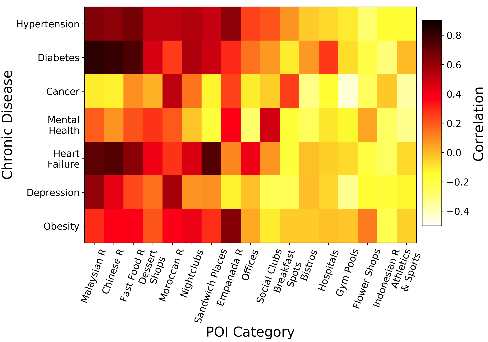

## Predicting the Spatio-Temporal Evolution of Chronic Diseases in Population with Human Mobility Data

### Abstract

> Understanding the distribution and progression of chronic diseases of a population is important in assisting the allocation of medical resources as well as the design of policies in preemptive healthcare.

> raditional methods to obtain large scale indicators on population health, e.g., surveys and statistical analysis, can be costly and time-consuming and often lead to a coarse spatio-temporal picture.

```markdown
```
### 3 Disease Rate Evolution Prediction
#### 3.1 Problem Definition 

* **data processing**
1) **Human mobility records**, e.g., the check-ins dataset of Foursquare app, reflect people’smovements in the physical world and to some extent reveal their lifestyles, which gradually affect their health conditions<br>
**Dataset description**:2010 to Dec. 2013 created at 18,018 POI venues in 426 categories, e.g., fast food restaurant, gym, park, etc. There are over 4 million check-in transition between pairs of POIs<br>

|Venues in 426 categorites\timestamp|Dec. 2010 |...| Dec. 2013|
|-----------------------------------|----------|---|----------|
|Venues 1                           |          |   |          |
|...                                |          |   |          |
|Venues 426                         |          |   |          |

2) **Chronic disease Dataset** contains the morbidity of 20 chronic diseases of 567 wards in London.

| Chronic diseases\morbidity\567wards in London|ward 1    |...| ward 567   |
|----------------------------------------------|----------|---|------------|
|Chronic diseases 1                            |          |   |            |
|...                                           |          |   |            |
|Chronic diseases 20                           |          |   |            |

* **Pearson correlation analysis**<br> 
Relationship between chronic diseases and human mobility patterns extracted

Following picture is distribution of the amount of POIs in the 630 wards of London.
.png width=295 height=225)


For each chronic disease, we sort the diseaseevolution rates of 567 wards and split the ranking list into *r segments* averagely (we set r = 19, so there are 30 wards in each of the first 18 segments and 27 wards in the last one). They calculate the mean value of disease evolution rate and mean check-in volume of each category of POI in every segment to get two *r*-length sequences.
For example:

|ward 1  | ward 2  | ward 3  | ... | ward 566| ward 567|
|--------|---------|---------|-----|---------|---------|
|   0.3  |   0.25  |  0.78   |     |0.68     |0.1      |

|ward 3  | ward 566| ward 1  | ... | ward 2  | ward 567|
|--------|---------|---------|-----|---------|---------|
|   0.78 |   0.68  |  0.3    |     |0.25     |0.1      |

one category of disease

|segment 1  |segment 2| ... |segment 29|segment 30|
|-----------|---------|-----|----------|----------|
| mean evolution rate 1|mean evolution rate 2| ... |mean evolution rate 29|mean evolution rate 30|

one category of POI (venues)

|segment 1  |segment 2| ... |segment 29|segment 30|
|-----------|---------|-----|----------|----------|
|mean check-in volume 1|mean check-in volume 2| ... |mean check-in volume 29|mean check-in volume 30|

Then, calculate the correlation coeficient between the two types of sequences. we find that several categories, such as Malaysian restaurants, Chinese restaurants, and fast food restaurants, have high positive correlations with most of the 7 diseases except cancer.

the correlation results between evolution rate of 7 most common chronic diseases and check-in amount of 17 categories of POIs from 2010 to 2013 in London are tested and presented in following picture.



#### 3.2 Overview
1) leverage an embedding method and a Gaussian mixture approach to aggregate categories of venues into several clusters according to their check-in patterns.Through that, we obtain a denser region-cluster-of-venues matrix.
2) Then apply a collaborative topic modeling method to extract lifestyle patterns of each region from human’s check-in mobility.
* **Venue Aggregation**
